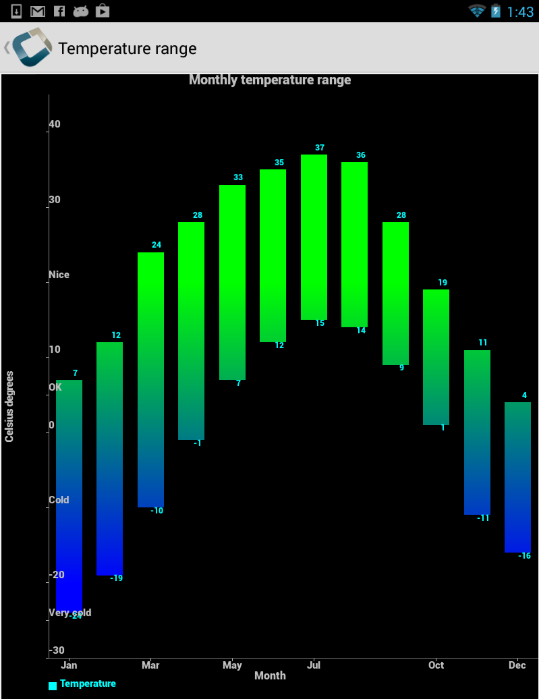
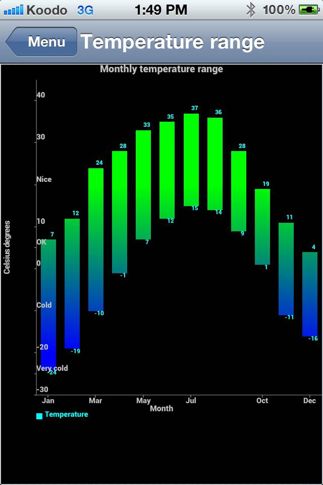

#A Chart Engine for Codename One

This is a port of the fantastic android [achartengine](https://code.google.com/p/achartengine/) for [Codename One](http://www.codenameone.com).

##License

Apache License 2.0

##Project Status

Alpha.

* Currently provides full compatibility for rendering of all charts offered by achartengine.
* Still need to add better support for event handling (pan & zoom).
* Tested so far only on iOS, Android, and the Simulator.  Still need to test on J2ME, RIM, and Windows Phone.  But should work.
* Uses a mixture of the CN1Pisces library and the Codename One Graphics class for 2D drawing.  Periodically running into bugs on various platforms (mainly iOS) with some 2D drawing primitives.

##Dependencies

1. The [CN1Pisces](https://github.com/shannah/CN1Pisces) library.
2. The [CN1FontBox](https://github.com/shannah/CN1FontBox) library.

##Installation

1. Add the [CN1Pisces](https://github.com/shannah/CN1Pisces) library to your Netbeans project.
2. Add the [CN1FontBox](https://github.com/shannah/CN1FontBox) library to your Netbeans project.
3. Copy the CN1aChartEngine.cn1lib file into your Netbeans project's lib directory.
4. Select "Refresh Libs" in your project by right clicking on the project icon in the project explorer and selecting "Refresh Libs" from the menu.

##Usage

This port was created by adding a compatibility layer upon which achartengine runs.  achartengine's code was left largely intact except in places where it called methods whose classes exist in codename one but don't contain the specified method (e.g. String.split()).  In those cases the code was only changed slightly to call utility functions in the compatibility layer.

Therefore, you should be able to use the API for achartengine exactly it is used in its original Android library form.  All examples and documentation you find in the achartengine site and referencing sites should work pretty much unchanged with the exception that classes in the android.* namespace should be changed to either reference Codename One equivalents or corresponding classes inside the org.achartengine.compat package (i.e. the compatibility layer).

###ChartFactory

The ChartFactory class is a good starting point for getting into making charts.  It provides a facade for creating views of all of the chart types in the library.  It provides two flavours of generator for each chart type:

1. getXXXChartView() - Returns a GraphicalView object which wraps a Codename One Component that renders the chart.  This component can be added anywhere into the Codename One component hierarchy just like any other component like Label and Button.
2. getXXXChartIntent() - Returns an Intent object, which can be used to show a Form containing the chart view.

###Example

~~~~

    double[] minValues = new double[] { -24, -19, -10, -1, 7, 12, 15, 14, 9, 1, -11, -16 };
    double[] maxValues = new double[] { 7, 12, 24, 28, 33, 35, 37, 36, 28, 19, 11, 4 };

    XYMultipleSeriesDataset dataset = new XYMultipleSeriesDataset();
    RangeCategorySeries series = new RangeCategorySeries("Temperature");
    int length = minValues.length;
    for (int k = 0; k < length; k++) {
      series.add(minValues[k], maxValues[k]);
    }
    dataset.addSeries(series.toXYSeries());
    int[] colors = new int[] { Color.CYAN };
    XYMultipleSeriesRenderer renderer = buildBarRenderer(colors);
    setChartSettings(renderer, "Monthly temperature range", "Month", "Celsius degrees", 0.5, 12.5,
        -30, 45, Color.GRAY, Color.LTGRAY);
    renderer.setBarSpacing(0.5);
    renderer.setXLabels(0);
    renderer.setYLabels(10);
    renderer.addXTextLabel(1, "Jan");
    renderer.addXTextLabel(3, "Mar");
    renderer.addXTextLabel(5, "May");
    renderer.addXTextLabel(7, "Jul");
    renderer.addXTextLabel(10, "Oct");
    renderer.addXTextLabel(12, "Dec");
    renderer.addYTextLabel(-25, "Very cold");
    renderer.addYTextLabel(-10, "Cold");
    renderer.addYTextLabel(5, "OK");
    renderer.addYTextLabel(20, "Nice");
    renderer.setMargins(new int[] {30, 70, 10, 0});
    renderer.setYLabelsAlign(Align.RIGHT);
    XYSeriesRenderer r = (XYSeriesRenderer) renderer.getSeriesRendererAt(0);
    r.setDisplayChartValues(true);
    r.setChartValuesTextSize(12);
    r.setChartValuesSpacing(3);
    r.setGradientEnabled(true);
    r.setGradientStart(-20, Color.BLUE);
    r.setGradientStop(20, Color.GREEN);
    Intent intent = ChartFactory.getRangeBarChartIntent(context, dataset, renderer, Type.DEFAULT,
        "Temperature range");
    
    Context context = new Context();
	context.startActivity(intent);

~~~~

Result:

(This screenshot was taken directly from a Nexus 7 Android Device)

Same chart running on iPhone4S:

##Screenshots

